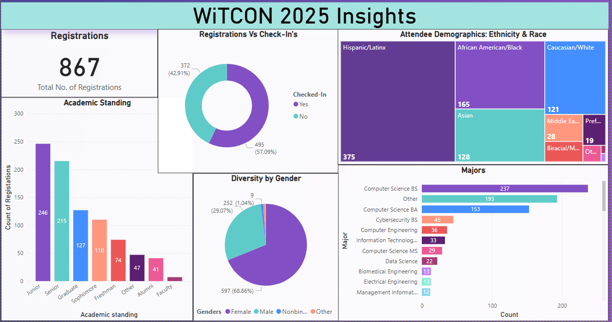

# 📊 WiTCON 2025 Data Insights Dashboard

This Power BI dashboard presents key insights and trends from the **WiTCON 2025** registration data. The project explores attendee demographics, academic backgrounds, and event participation. The goal is to inform future outreach, improve diversity tracking, and guide event planning for upcoming years.

---

## ✨ Key Insights

### 🔢 Total Registrations
- **867 total registrations**
- **57.09% checked in** during the event

### 🎓 Academic Standing
- Most attendees were **Juniors (246)** and **Seniors (215)**
- **Graduate and Sophomore** students followed
- Small but present group of **Faculty and Alumni**

### 🌐 Gender Diversity
- **68.86% Female**
- **29.07% Male**
- Non-binary and other gender identities represented, highlighting inclusivity

### 🧬 Race & Ethnicity
- **Hispanic/Latinx:** 375  
- **Black/African American:** 165  
- Also represented:
  - Asian: 128  
  - White: 121  
  - Middle Eastern: 28  
  - Biracial: 19  
  - Other/Prefer not to answer

### 🧠 Majors
- Strong representation in **Computer Science:**
  - BS: 237  
  - BA: 153  
- Other represented majors:
  - Cybersecurity, Computer Engineering, Data Science, Information Technology

---

## 🛠️ Process Overview

### Data Source
- CSV file: `✨WiTCON 2025✨ - Guests - 2025-03-31.csv`
- Cleaned and transformed in **Power BI Power Query**

### Data Preparation
- Removed blanks and nulls
- Standardized column names
- Converted data types
- Removed duplicates

### Dashboard Elements
- **Card:** Total Registrations
- **Donut Chart:** Check-in breakdown & Gender
- **Bar Chart:** Academic Standing & Majors
- **Treemap:** Ethnicity and Race

---

## 🎨 Theme & Design
- Custom Power BI JSON theme matching WiTCON branding
- Soft, inclusive palette with purples and neutrals
- Clear, legible typography

> Made with 💜 using Power BI for WiTCON 2025
